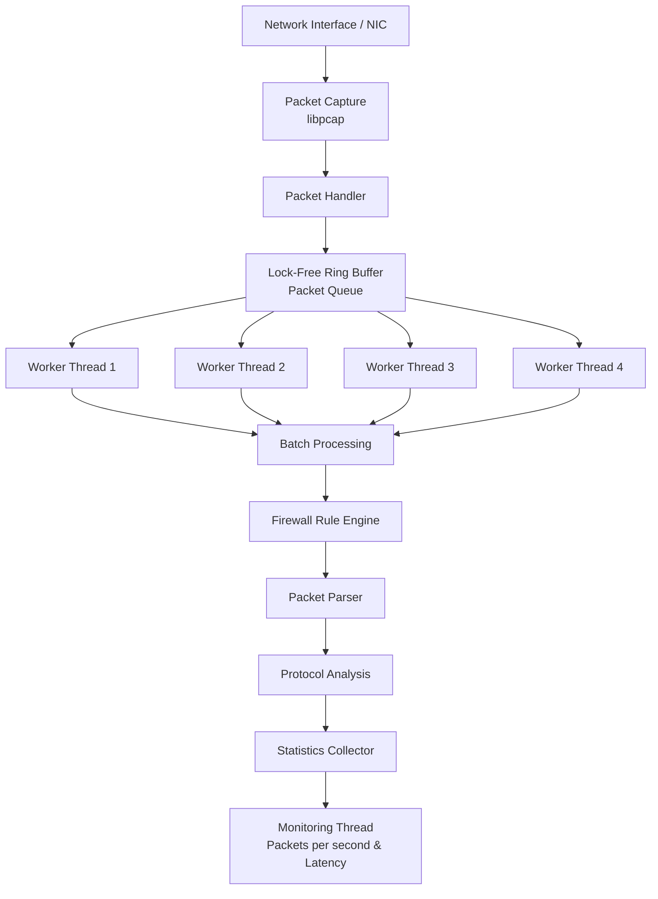

# Packet Processing Architecture

```mermaid
flowchart TD

A[Network Interface / NIC] --> B[Packet Capture<br>libpcap]

B --> C[Packet Handler]

C --> D[Lock-Free Ring Buffer<br>Packet Queue]

D --> E[Worker Thread 1]
D --> F[Worker Thread 2]
D --> G[Worker Thread 3]
D --> H[Worker Thread 4]

E --> I[Batch Processing]
F --> I
G --> I
H --> I

I --> J[Firewall Rule Engine]

J --> K[Packet Parser]

K --> L[Protocol Analysis]

L --> M[Statistics Collector]

M --> N[Monitoring Thread<br>Packets per second & Latency]
```